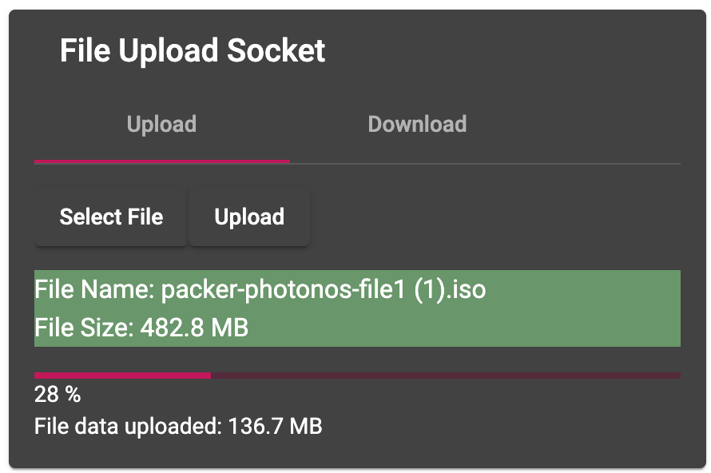
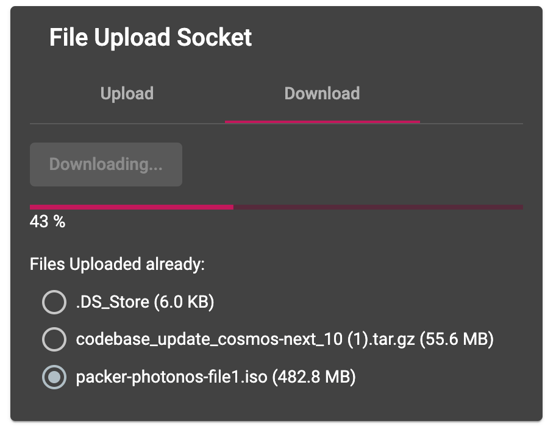
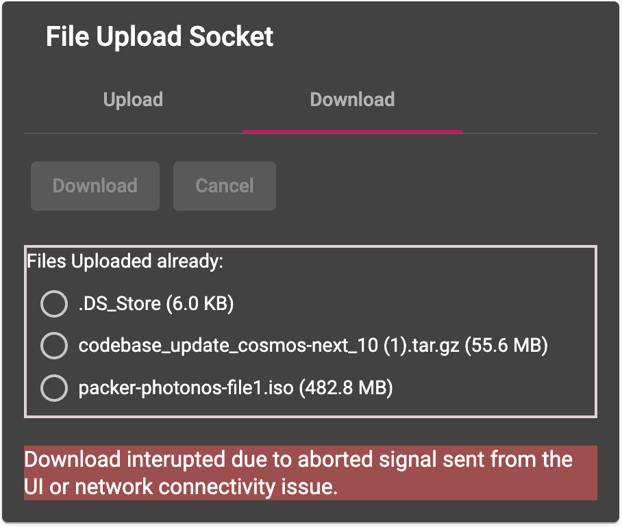
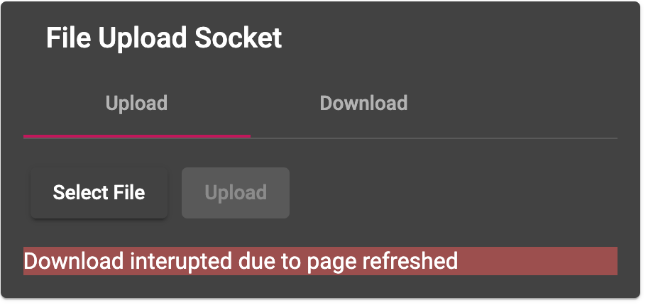

# Solution Design

- Proper way to download or upload very big files with realtime data streaming and information.<br />
- Consume less memory and do not break or crash server or client browser.<br />
- Control Blob chunks to be R/W and streamed.<br />
- Resumability for uploaded files - continue uploading the file from the last written bytes on the server side.<br />
- Cancelation for downloading file.<br />
- Handle Browser refresh and cancel downloading file.<br />

## Software set:

- <b>Socket.io</b>: Bi-directional communication between client and server<br />
- <b>NodeJS</b>: Backend using native fs to R/W files in proper way by defined chunk size.<br />
- <b>Angular</b>: Frontend is using File System Access API to instruct client browser to write Blob chunks directly on client OS.<br />

### More information:<br />

- Window.showSaveFilePicker: https://developer.mozilla.org/en-US/docs/Web/API/Window/showSaveFilePicker
- Types: https://www.npmjs.com/package/@types/wicg-file-system-access <br />

## Application UI Example:

### Upload



### Download



### Interuption due browser refresh or cancel button clicked


<br />


# Run Backend

Install dependencies

```shell
yarn install
```

Run app:

```shell
npx ts-node server/src/server.ts
```

Exposed on port: 3300 (Change LISTEN_PORT in server.ts)

# Run Frontend

cd client/

Install dependencies

```shell
yarn install
```

Run app:

```shell
yarn start
```

Application is listening on

```
http://localhost:4200/
```

# Configurations - global.conf.ts

```ts
// Port to be used in the backend to expose the application.
export const BACKEND_LISTEN_PORT = 3300;

// SocketIO origin URL
export const BACKEND_SOCKETIO_ORIGIN = "http://localhost:4200";

// SocketIO URL that also depends on BACKEND_LISTEN_PORT
export const FRONTEND_SOCKETIO_URL = `http://localhost:${BACKEND_LISTEN_PORT}`;

// This is createReadStream highWaterMark size.
export const RW_CHUNK_SIZE = 8 * 1024 * 100; // 500kb;

// How much of the file we want to read, which defines startingRange for R/W.
export const RW_BUFFER_GET_SIZE = 8 * 1024 * 100; // 500kb

// Stream file here, once all content is ready copy to data Folder.
export const STREAM_FOLDER = "./server/data_stream";

// Directory to save files to
export const DATA_FOLDER = "./server/data";
```
